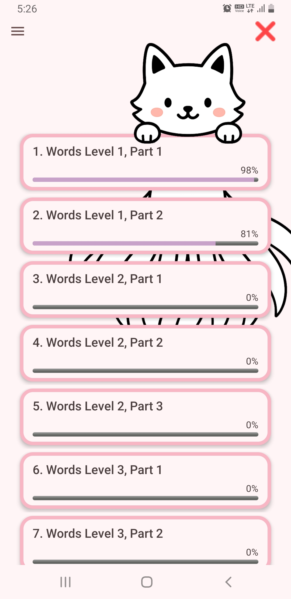
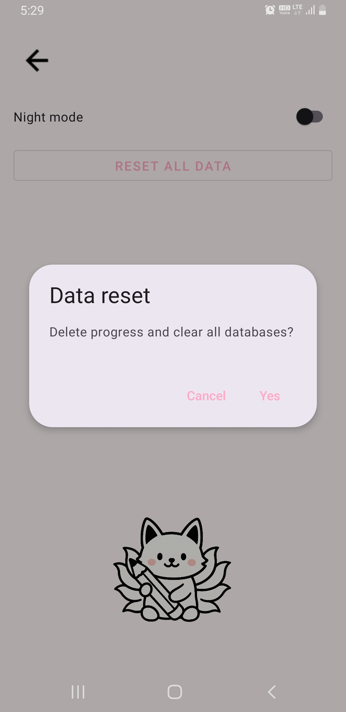

# Flashcard

An Android application for learning Korean vocabulary using spaced repetition.

---

## Table of Contents

- Description  
- Screenshots  
- Features  
- Technologies  

---

## Description

**Flashcard** is a mobile Android application designed to help learners memorize Korean words and expressions.  
Vocabulary is organized into multiple levels (similar to TOPIK 1–6).  
Each card has its own learning state and next review date.  
The app works entirely **offline** using a local database.

Key principles:

- Minimalistic pastel-themed UI  
- A friendly fox mascot that appears throughout the interface  
- Smart spaced repetition logic for efficient memorization  

---

## Screenshots

  
  

---

## Features

- Multiple decks by level (TOPIK 1–6)  
- Progress tracking for each deck (learned / excluded / total)  
- Study mode with:
  - Hidden translation and “Show Translation” button  
  - Difficulty rating: **Easy / Medium / Hard**  
  - Automatic spaced-repetition scheduling  
- Ability to exclude words from study  
- Light and dark themes  
- Preloaded offline vocabulary database  
- Adaptive layout for different screen sizes  

---

## Technologies

- **Language:** Java (Android)  
- **Libraries & Tools:**
  - AndroidX, AppCompat, Material Components  
  - Room (local database; multiple DB files for each deck)  
  - RecyclerView  
  - Custom ItemDecoration (fox decoration)  
- **Build system:** Gradle  

---

