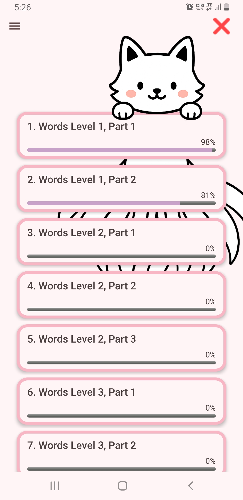
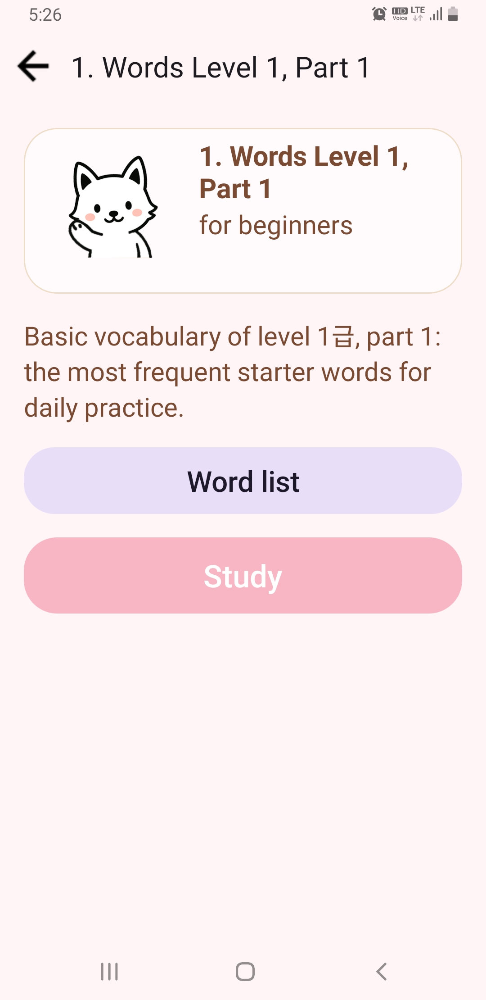
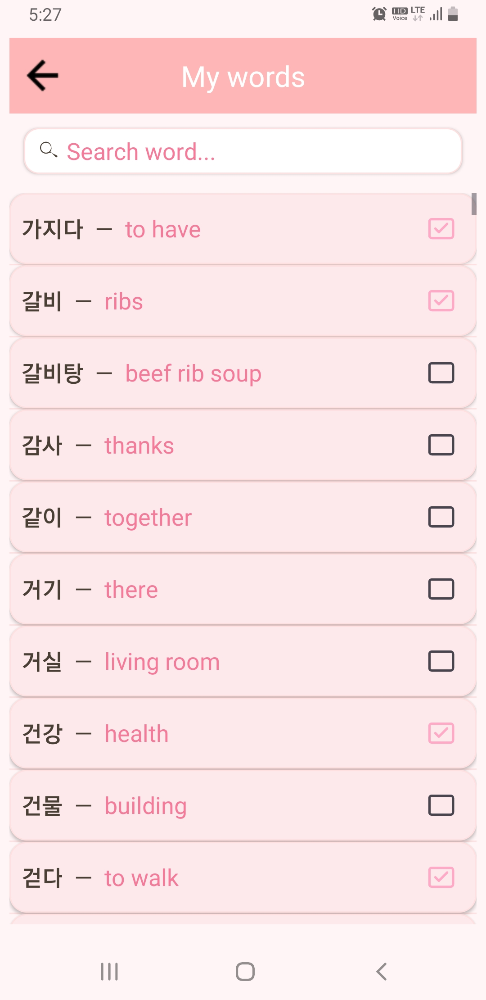
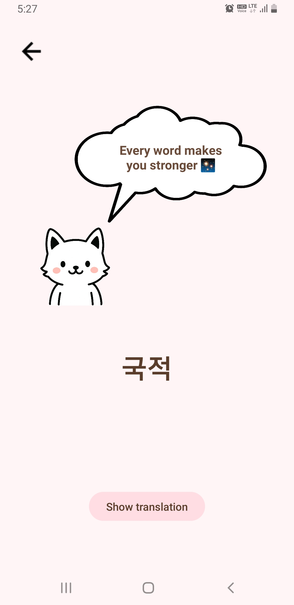
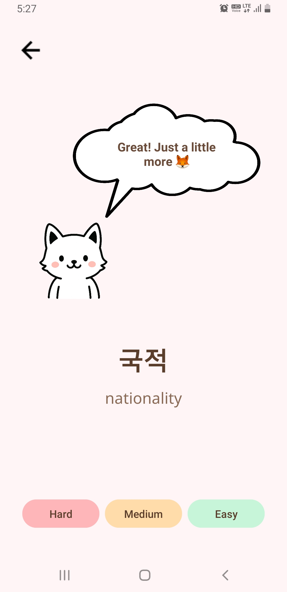
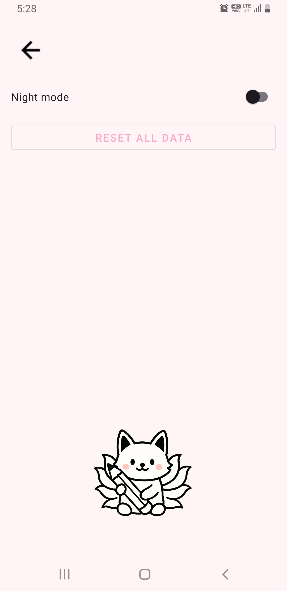
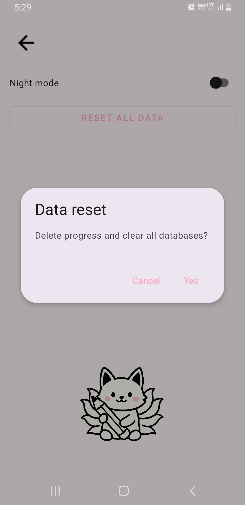
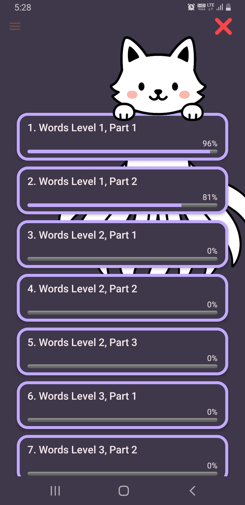

# Flashcard

An Android application for learning Korean vocabulary using spaced repetition.

---

## Table of Contents

- Description  
- Screenshots  
- Features  
- Technologies  

---

## Description

**Flashcard** is a mobile Android application designed to help learners memorize Korean words and expressions.  
Vocabulary is organized into multiple levels (similar to TOPIK 1–6).  
Each card has its own learning state and next review date.  
The app works entirely **offline** using a local database.

Key principles:

- Minimalistic pastel-themed UI  
- A friendly fox mascot that appears throughout the interface  
- Smart spaced repetition logic for efficient memorization  

---

## Screenshots

  
  
  

  
  
  

  
  

---

## Features

- Multiple decks by level (TOPIK 1–6)  
- Progress tracking for each deck (learned / excluded / total)  
- Study mode with:
  - Hidden translation and “Show Translation” button  
  - Difficulty rating: **Easy / Medium / Hard**  
  - Automatic spaced-repetition scheduling  
- Ability to exclude words from study  
- Light and dark themes  
- Preloaded offline vocabulary database  
- Adaptive layout for different screen sizes  

---

## Technologies

- **Language:** Java (Android)  
- **Libraries & Tools:**
  - AndroidX, AppCompat, Material Components  
  - Room (local database; multiple DB files for each deck)  
  - RecyclerView  
  - Custom ItemDecoration (fox decoration)  
- **Build system:** Gradle  

---

# Flashcard

한국어 어휘 학습을 위한 간격 반복(Spaced Repetition) 기반 안드로이드 애플리케이션

---

## 목차

- 설명  
- 스크린샷  
- 기능  
- 기술  

---

## 설명

**Flashcard**는 학습자가 한국어 단어와 표현을 효율적으로 암기할 수 있도록 설계된 안드로이드 모바일 애플리케이션입니다.  
어휘는 TOPIK 1–6과 유사한 여러 단계로 구성되어 있습니다.  
각 카드에는 학습 상태와 다음 복습 일정이 개별적으로 저장됩니다.  
애플리케이션은 로컬 데이터베이스를 사용하여 **오프라인**에서도 완전히 동작합니다.

핵심 원칙:

- 파스텔 톤의 미니멀한 UI  
- 인터페이스 전반에 등장하는 친근한 여우 마스코트  
- 효율적인 암기를 위한 스마트 간격 반복 알고리즘  

---

## 기능

- 단계별 덱 구성 (TOPIK 1–6)  
- 각 덱의 학습 진행도 표시 (학습됨 / 제외됨 / 전체)  
- 학습 모드:
  - 번역 숨김 및 “번역 보기” 버튼  
  - 난이도 선택: **Easy / Medium / Hard**  
  - 자동 간격 반복 스케줄링  
- 학습에서 단어 제외 기능  
- 라이트 / 다크 테마 지원  
- 사전 로드된 오프라인 어휘 데이터베이스  
- 다양한 화면 크기에 대응하는 적응형 레이아웃  

---

## 기술

- **언어:** Java (Android)  
- **라이브러리 및 도구:**
  - AndroidX, AppCompat, Material Components  
  - Room (로컬 데이터베이스; 덱별 다중 DB 파일)  
  - RecyclerView  
  - 커스텀 ItemDecoration (여우 장식)  
- **빌드 시스템:** Gradle  
